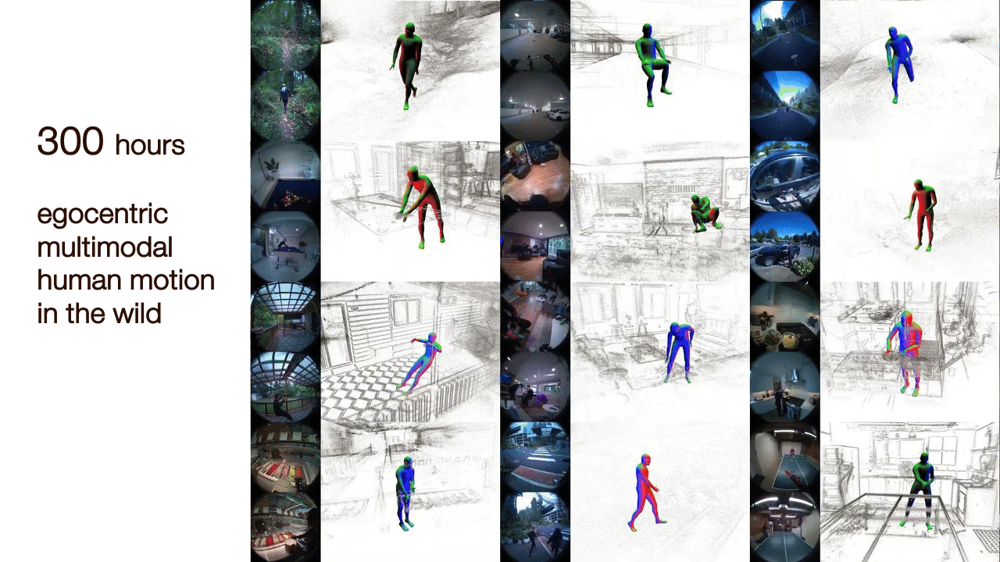

# Nymeria Dataset

[[Project Page]](https://www.projectaria.com/datasets/nymeria/)
[[Data Explorer]](https://explorer.projectaria.com/?v=%22Nymeria%22)
[[Paper]](https://arxiv.org/abs/2406.09905) [[Bibtex]](#attribution)

Nymeria is the world's largest dataset of human motion in the wild, capturing
diverse people engaging in diverse activities across diverse locations. It is
first of its kind to record body motion using multiple egocentric multimodal
devices, all accurately synchronized and localized in one single metric 3D
world. Nymeria also holds the distinction of the world's largest dataset of
motion-language descriptions, featuring hierarchical in-context narration. The
dataset is designed to accelerate research in egocentric human motion
understanding and present exciting new challenges beyond body tracking, motion
synthesis and action recognition. It aims to advance contextualized computing
and pave the way for future AR/VR technology. This repository hosts the official
API for downloading and loading the dataset.

<p align="center">
  
  
</p>

## Getting Started

### Installation

We use conda and pip to manage python dependencies and package distribution. Run
the following command. This will create a virtual environment `nymeria` where
this repository is installed by pip.

```
   git clone git@github.com:facebookresearch/nymeria_dataset.git
   cd nymeria_dataset
   conda env create -f environment.yml
   conda activate nymeria
```

### Download the dataset

Review the dataset [LICENSE](./LICENSE) to ensure your application is covered
before proceeding further.

**Before you start** Nymeria dataset has more than 1200 sequences, and each
sequence contains data/annotations recorded by multiple devices. Altogether the
dataset is approximately 70TB. To easy data access, the dataset is chunked into
sequences and sequences into data groups. A data group is a fixed collection of
files, which must be downloaded together via one url. The predefined data groups
are specified by `GroupDefs` in
[definition.py](https://github.com/facebookresearch/nymeria_dataset/blob/main/nymeria/definitions.py#L29-L83).
Given the large quantity of data, we generate a list of attributes for each
sequences to enable filtering. The list of attributes is described in
[sequence_attributes.py](https://github.com/facebookresearch/nymeria_dataset/blob/main/nymeria/sequence_attributes.py#L10-L62).
With this in mind, choose one of the following two paths to access data.

**Option 1** Download small sample files for initial exploration. Visit
[dataset explorer](https://explorer.projectaria.com/?v=%22Nymeria%22), click any
sequences for detailed view. On the right panel, locate a list of links to
download particular data groups for the sequence.

**Option 2** Download multiple sequences to do research experiments. For batch
download, we provide a JSON file (`Nymeria_download_urls.json`) containing urls
of all data groups of all **requested** sequences. There are two ways to access
this JSON file. If you wish to only download sequences satisfy certain criteria
(e.g., particular scripts, head trajectory length, location, activity duration
etc), visit
[dataset explorer](https://explorer.projectaria.com/?v=%22Nymeria%22). On the
top, locate the text box `filter dataset by` to filter sequences by their
attributes, then click `Download found sequences` to obtain the JSON file. To
access the full dataset, simply leave the filter box empty. Alternatively, visit
the [project page](https://www.projectaria.com/datasets/nymeria/), sign up with
your email by **Access the Dataset** at the bottom to be directed to download,
then click `DATA (Nymeria_download_urls.json)`.

Once you obtain the JSON file, you can access the data by traverse the url
links. For convinience, we provide [download.py](./download.py) as an example
script to parses the JSON file and download data into formatted directories.

```
# Activate environment
conda activate nymeria

# Go to your local copy of the code repository
cd nymeria_dataset

python download.py -i <Nymeria_download_urls.json> -o <dataset_outpath>
```

The download script will require your confirmation to proceed downloading. Under
`<dataset_outpath>`, we produce a `download_summary.json` file to summarize the
download status. For applications only require a subset of data, we implement 2
filters to configure download.

- Filter by sequence name. We name the sequences by the following convention
  `<date>_<session_id>_<fake_id>_<act_id>_<uid>`. This allow sequence selection
  by partial key matching. **TIP** you can use complex filters to select
  sequences from
  [data browser](https://explorer.projectaria.com/?v=%22Nymeria%22).

```
python download.py -i <Nymeria_download_urls.json> -o <dataset_outpath> -k <partial_key>

# E.g., get all sequences collected in June
python download.py -i <Nymeria_download_urls.json> -o <dataset_outpath> -k 202306

# E.g., get all sequences from participant with fake_id = james_johnson
python download.py -i <Nymeria_download_urls.json> -o <dataset_outpath> -k james_johnson

# E.g., get a particular sequence with uid egucf6
python download.py -i <Nymeria_download_urls.json> -o <dataset_outpath> -k egucf6
```

- Filter by data groups. Open
  [download.py](https://github.com/facebookresearch/nymeria_dataset/blob/main/download.py#L9-L29)
  and change the function `get_groups()`.

### Visualize the data

## License

Nymeria dataset and code is released by Meta under the Creative Commons
Attribution-NonCommercial 4.0 International License
([CC BY-NC 4.0](https://creativecommons.org/licenses/by-nc/4.0/legalcode)). Data
and code may not be used for commercial purposes. For more information, please
refer to the [LICENSE](./LICENSE) file included in this repository.

### Attribution

When using the dataset and code, please attribute it as follows:

```
@inproceedings{ma24eccv,
      title={Nymeria: A Massive Collection of Multimodal Egocentric Daily Motion in the Wild},
      author={Lingni Ma and Yuting Ye and Fangzhou Hong and Vladimir Guzov and Yifeng Jiang and Rowan Postyeni and Luis Pesqueira and Alexander Gamino and Vijay Baiyya and Hyo Jin Kim and Kevin Bailey and David Soriano Fosas and C. Karen Liu and Ziwei Liu and Jakob Engel and Renzo De Nardi and Richard Newcombe},
      booktitle={the 18th European Conference on Computer Vision (ECCV)},
      year={2024},
      url={https://arxiv.org/abs/2406.09905},
}
```

### Contribute

We welcome contributions! Go to [CONTRIBUTING](.github/CONTRIBUTING.md) and our
[CODE OF CONDUCT](.github/CODE_OF_CONDUCT.md) for how to contribute.
