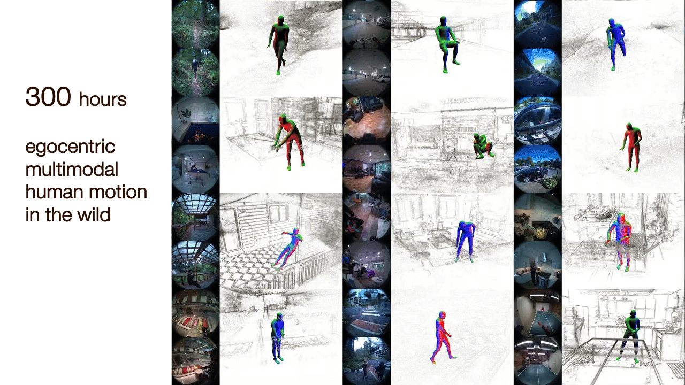
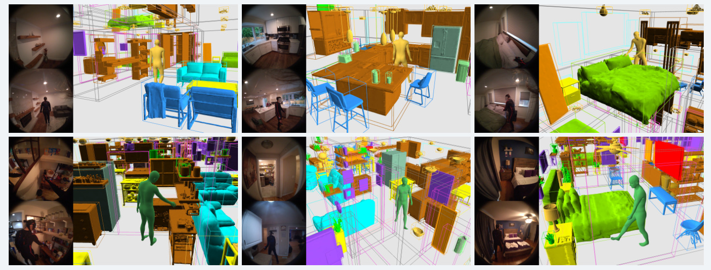

# Nymeria and NymeriaPlus Dataset

[[Project Page]](https://www.projectaria.com/datasets/nymeria/)
[[Data Explorer]](https://explorer.projectaria.com/nymeria)
[[Paper]](https://arxiv.org/abs/2406.09905) [[Bibtex]](#attribution)

Nymeria is the world's largest dataset of human motion in the wild, capturing
diverse people performing diverse activities across diverse locations. It is
first of a kind to record body motion using multiple egocentric multimodal
devices, all accurately synchronized and localized in one metric 3D world.
Nymeria is also the world's largest motion dataset with natural language
descriptions. The dataset is designed to accelerate research in egocentric human
motion understanding and presents exciting challenges to advance contextualized
computing and future AR/VR technology. This repository hosts the API for
downloading and visualizing the dataset.

<p align="center">
  
  
</p>

## 🔥 What's New
We are excited to announce that we have upgraded Nymeria dataset into **[NymeriaPlus](https://arxiv.org/pdf/2603.18496v1)**
with additional annnotations and data.
NymeriaPlus features: (1) improved human motion on both [MHR](https://github.com/facebookresearch/MHR)
and [SMPL](https://smpl.is.tue.mpg.de/) formats; (2) dense 3D and 2D bounding box annotations for indoor objects and structured elements;
(3) instance-level 3D object reconstruction from [ShapeR](https://github.com/facebookresearch/ShapeR);
and (4) additional modalities such as basemap recordings, wristband videos, headset audio and etc.
Data will be released soon in the coming few weeks. Stay tuned!

<p align="center">
  
</p>
<br>

## Getting Started

### Installation

Clone the repository:

```
git clone git@github.com:facebookresearch/nymeria_dataset.git
cd nymeria_dataset
```

#### Option A: Using conda

```
conda env create -f environment.yml
conda activate pymeria
```

#### Option B: Using pixi

[Pixi](https://pixi.sh) manages both conda and pip dependencies without
requiring a separate conda installation.

```bash
# Install the environment (reads pixi.toml)
pixi install
```

Use `pixi run` to execute commands inside the environment:

```bash
pixi run python viewer.py -i <nymeria_sequence_path> [-s]
pixi run python download.py -i <urls.json> -o <output_path>

# Or use the predefined tasks
pixi run view -- -i <nymeria_sequence_path> -s
pixi run download -- -i <urls.json> -o <output_path>
```

### Download dataset

Review the dataset [LICENSE](./LICENSE) to ensure your use case is covered.

**Before you start.** Nymeria has more than 1200 sequences, and each sequence
contains data/annotations recorded by multiple devices. Altogether the dataset
is approximately 70TB. To easy access, the dataset is chunked into sequences and
sequences into data groups. A data group is a fixed collection of files, which
must be downloaded together via a url. The predefined data groups are specified
in
[definition.py](https://github.com/facebookresearch/nymeria_dataset/blob/main/nymeria/definitions.py).
Each sequence is tagged by a list of attributes, as described in
[sequence_attributes.py](https://github.com/facebookresearch/nymeria_dataset/blob/main/nymeria/sequence_attributes.py).
We have built basic support to filter sequences by their attributes. With this
in mind, continue with one of the following paths.

**Option 1 - Download sample files.** Visit
[dataset explorer](https://explorer.projectaria.com/nymeria), click any
sequences for detailed view. On the right panel, locate a list of links to
download particular data groups for that sequence.

**Option 2 - Batch download multiple sequences.** For batch download, you need
to obtain a JSON file with urls. There are two ways to achieve this. First, you can visit the
[project page](https://www.projectaria.com/datasets/nymeria/), and sign up for
_Access the Dataset_ located at the bottom to be directed to the download page. The
downloaded file will contain the urls to the full dataset. Alternatively, you can
generate a customized JSON file with selected sequences and modalities on
[dataset explorer](https://explorer.projectaria.com/nymeria). Either way, the urls provided by the JSON file is valid for 14
days. Please obtain a new JSON file upon expiration.

With the JSON file, you can visit the urls to download data. For convinience, we
provide [download.py](./download.py) as an example script to parses the JSON
file and download data into formatted directories. Run the script as follows.

```
# With conda
conda activate pymeria
python download.py -i <nymeria_download_urls.json> -o <output_path> [-k <partial_matching_key>]

# With pixi
pixi run python download.py -i <nymeria_download_urls.json> -o <output_path> [-k <partial_matching_key>]
```

The downloading script will produce a `download_summary.json` under the `<output_path>`. To customize the data groups to be downloaded, modify the function
[`get_groups()`](https://github.com/facebookresearch/nymeria_dataset/blob/main/download.py). The optional argument `-k`
implements a partial key matching to select sequences. Nymeria sequences
are named by the following convention
`<date>_<session_id>_<fake_name>_<act_id>_<uid>`. Here are some examples for how
to use the sequence filter.

```
# E.g., get all sequences collected in June
python download.py -i <Nymeria_download_urls.json> -o <output_path> -k 202306

# E.g., get all sequences from participant with fake_name, 'james_johnson'
python download.py -i <Nymeria_download_urls.json> -o <output_path> -k james_johnson

# E.g., get a particular sequence with uid egucf6
python download.py -i <Nymeria_download_urls.json> -o <output_path> -k egucf6
```

### Load Nymeria data with visualization

To load Nymeria sequences, please refer to the implementation of
[`NymeriaDataProvider`](https://github.com/facebookresearch/nymeria_dataset/blob/main/nymeria/data_provider.py).
This class expects formatted sequence directory as downloaded by previous
section. It can be configured to load different modalities (c.f. `NymeriaDataProviderConfig`). Currently, this
class implements the following functions

- Loading Vrs recordings and their MPS location output.
- Loading body motion as XSens kinematic skeleton and Momentum parametric mesh
  model.
- Synchronize data from multiple sources.
- Compute alignment to register body motion into the same world coordinates of
  Aria devices.

To visualize a sequence, run the viewer as follows. Please download all
modalities for one sequence, to ensure the code runs as expected.

```
# With conda
conda activate pymeria
python viewer.py -i <nymeria_sequence_path> [-s]

# With pixi
pixi run python viewer.py -i <nymeria_sequence_path> [-s]
```

#### Alternative body models

In addition to the default Momentum body mesh, the viewer supports two
alternative body models: **SMPL** and **MHR** (Momentum Human Rig).

**SMPL** requires the `smplx` package (installed by default via conda/pixi files) and a SMPL model `.pkl` file (download SMPL model files from https://smpl.is.tue.mpg.de).

```
python viewer.py -i <sequence_path> --body-model smpl --smpl-model-path <path_to_smpl_model.pkl>
```

**MHR** requires the `mhr` package (installed by default via conda/pixi files).

```
python viewer.py -i <sequence_path> --body-model mhr
```

The following two figures show how the visualizer looks like. The 3D view renders body motion, point clouds and device trajectories. The 2D view renders synchronized RGB video from the participants Aria glasses and the observer Aria glasses. The code uses [rerun](https://rerun.io/) for rendering. You can toggle the viewer to show different modalities, and configure it by `NymeriaViewerConfig`.
<p align="center">
  
  
</p>

## License

Nymeria dataset and code is released by Meta under the Creative Commons
Attribution-NonCommercial 4.0 International License
([CC BY-NC 4.0](https://creativecommons.org/licenses/by-nc/4.0/legalcode)). Data
and code may not be used for commercial purposes. For more information, please
refer to the [LICENSE](./LICENSE) file included in this repository.

### Attribution

When using the Nymeria dataset and code, please attribute it as follows:

```
@inproceedings{nymeria24,
      title={Nymeria: A Massive Collection of Multimodal Egocentric Daily Motion in the Wild},
      author={Lingni Ma and Yuting Ye and Fangzhou Hong and Vladimir Guzov and Yifeng Jiang and Rowan Postyeni and Luis Pesqueira and Alexander Gamino and Vijay Baiyya and Hyo Jin Kim and Kevin Bailey and David Soriano Fosas and C. Karen Liu and Ziwei Liu and Jakob Engel and Renzo De Nardi and Richard Newcombe},
      booktitle={the 18th European Conference on Computer Vision (ECCV)},
      year={2024},
      url={https://arxiv.org/abs/2406.09905},
}
```

When using the NymeriaPlus dataset, please also attribute the following:
```
@misc{nymeriaplus26,
      title={NymeriaPlus: Enriching Nymeria Dataset with Additional Annotations and Data},
      author={Daniel DeTone and Federica Bogo and Eric-Tuan Le and Duncan Frost and Julian Straub and Yawar Siddiqui and Yuting Ye and Jakob Engel and Richard Newcombe and Lingni Ma},
      year={2026},
      eprint={2603.18496},
      archivePrefix={arXiv},
      primaryClass={cs.CV},
      url={https://arxiv.org/abs/2603.18496},
}
```

### Contribute

We welcome contributions! Go to [CONTRIBUTING](.github/CONTRIBUTING.md) and our
[CODE OF CONDUCT](.github/CODE_OF_CONDUCT.md) for how to contribute.
