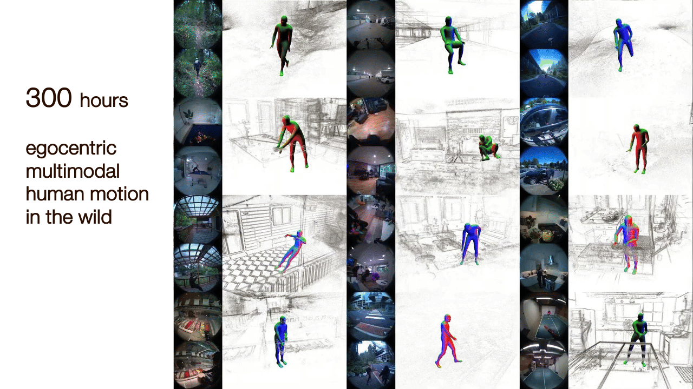
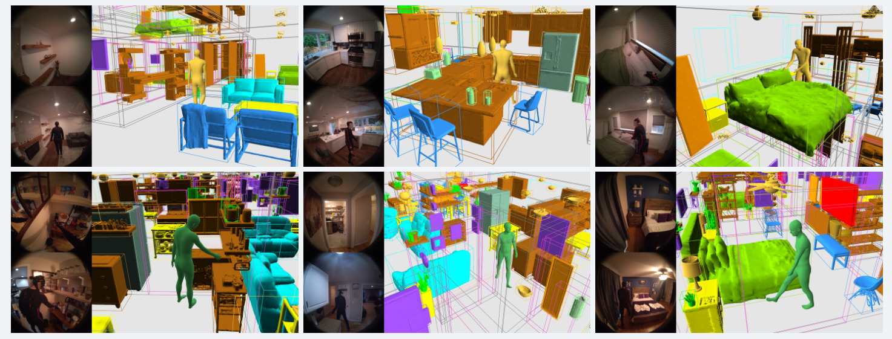
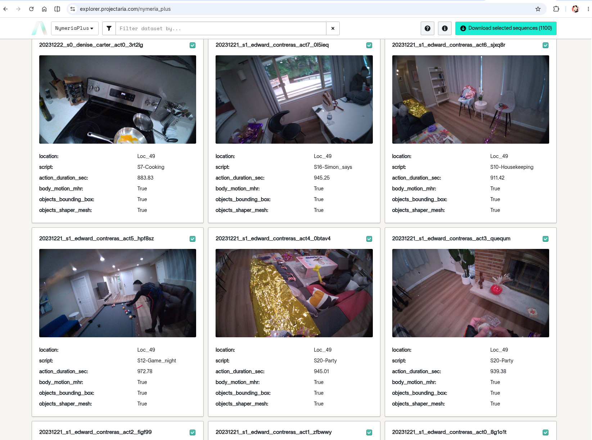
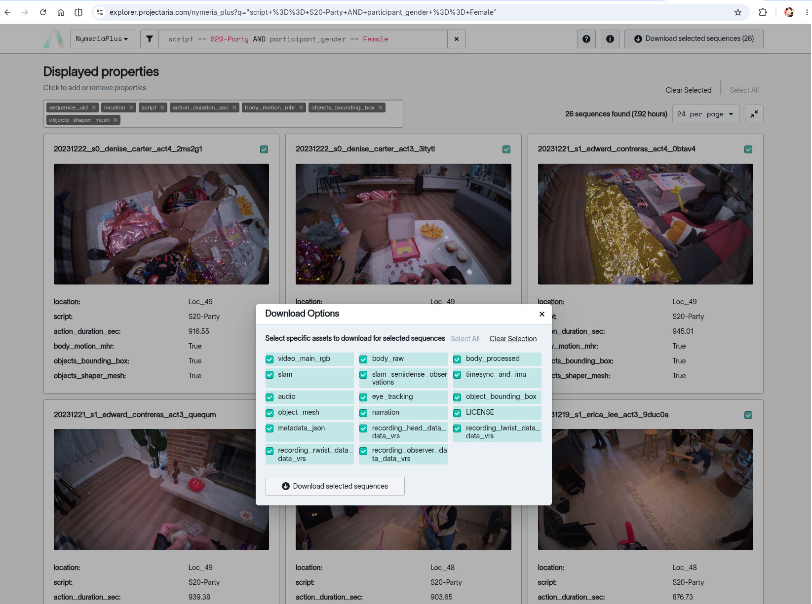
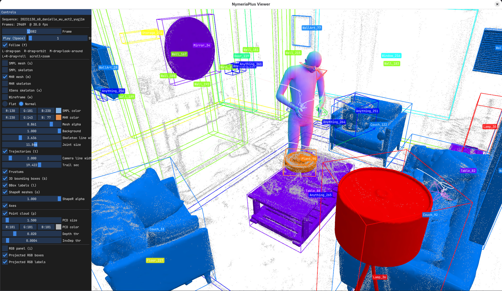
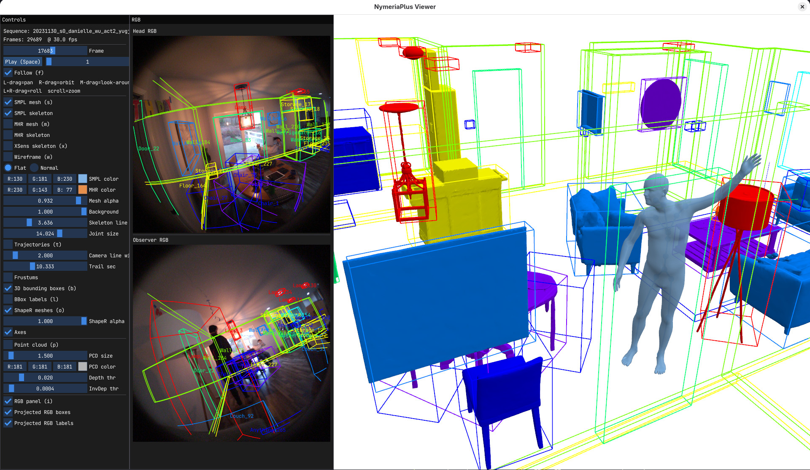

# Nymeria and NymeriaPlus Dataset

[[Nymeria Data Explorer]](https://explorer.projectaria.com/nymeria)
[[Nymeria Paper]](https://arxiv.org/abs/2406.09905)
[[NymeriaPlus Data Explorer]](https://explorer.projectaria.com/nymeria_plus)
[[NymeriaPlus Paper]](https://arxiv.org/abs/2603.18496)
[[Bibtex]](#attribution)

**Nymeria** is the world's largest dataset of human motion in the wild, capturing
diverse people performing diverse activities across diverse locations. It is
first of a kind to record body motion using multiple egocentric multimodal
devices, all accurately synchronized and localized in one metric 3D world.
Nymeria is also the world's largest motion dataset with natural language
descriptions. The dataset is designed to accelerate research in egocentric human
motion understanding and presents exciting challenges to advance contextualized
computing and future AR/VR technology.

<p align="center">
  
  
</p>

**NymeriaPlus** is an updated version of the original Nymeria dataset with
additional annnotations and data. NymeriaPlus features: (1) optimized human
motion in both [MHR](https://github.com/facebookresearch/MHR) and
[SMPL](https://smpl.is.tue.mpg.de/) formats; (2) dense 3D and 2D bounding box
annotations for indoor objects and structured elements; (3) instance-level 3D
object reconstruction based on [ShapeR](https://github.com/facebookresearch/ShapeR)
and human rating; and (4) additional modalities such as basemap recordings,
wristband videos, headset audio and etc.

<p align="center">
  
</p>
<br>

This repository hosts the API for downloading and visualizing the dataset. The
`main` branch best supports the NymeriaPlus dataset. For the Nymeria dataset,
switch to the `nymeria_dataset_legacy` branch if `main` does not work.

## Getting Started

### Installation

Clone the repository:

```
git clone git@github.com:facebookresearch/nymeria_dataset.git
cd nymeria_dataset
```

#### Option A: install with uv

This route works well on Linux and partially on MacOS if your workflow does not
require loading MHR human motion. The installation requires Python 3.12 and is
managed with [uv](https://docs.astral.sh/uv/) by default. From the repository
root:

```bash
# Linux/MacOS: install uv if it is not already available
curl -LsSf https://astral.sh/uv/install.sh | sh
```

```bash
uv sync                 # runtime deps, including projectaria-tools, torch, and pymomentum-cpu
uv sync --extra gpu     # use CUDA-supported pymomentum-gpu on supported platforms
uv sync --extra smpl    # add SMPL body model support
```

`pymomentum-cpu` depends on PyTorch's shared libraries at runtime. If importing
`pymomentum` fails with a missing `libtorch.so`, point `LD_LIBRARY_PATH` at the
uv environment's torch library directory before running scripts:

```bash
export LD_LIBRARY_PATH="$(pwd)/.venv/lib/python3.12/site-packages/torch/lib:${LD_LIBRARY_PATH:-}"
```

#### Option B: install with conda

If your workflow requires loading MHR human motion on MacOS, you need to use
Conda to install `pymomentum-cpu>=0.1.110` from conda-forge with the matching
PyTorch 2.10 runtime, which provides the native dependency stack missing from
the experimental PyPI macOS wheel.

```bash
conda env create -f environment.yml
conda activate nymeriaplus
python -m pip install -r requirements-conda-pip.txt
```

### Downloading data

Before running the code, you need to obtain a valid URL JSON file for the
NymeriaPlus dataset from
[this site](https://explorer.projectaria.com/nymeria_plus), and for the Nymeria
dataset from [this site](https://explorer.projectaria.com/nymeria). Both
websites allow you to filter sequences according to various attributes, e.g., by
location, date, activity scenarios, and available annotations. Nymeria and
NymeriaPlus datasets each provide 1100 sequences, which in total amounts to
~80 TB per dataset. For convenience, we group files by groups, as defined in
[`nymeriaplus/layout.py`](./nymeriaplus/layout.py). You can choose which groups
to download after selecting the sequences from the corresponding websites.

<p align="center">
  
  
</p>

After obtaining the JSON file, run the following script to download data. For
downloading the Nymeria dataset, switch to the `nymeria_dataset_legacy` branch.

With the `uv` install:

```bash
uv run nymeriaplus-download -i /path/to/url.json -o /path/to/outdir -y

# equivalent invocations
uv run python -m nymeriaplus.cli.download -i /path/to/url.json -o /path/to/outdir -y
uv run python nymeriaplus/cli/download.py -i /path/to/url.json -o /path/to/outdir -y

# or activate the environment first
source .venv/bin/activate
python nymeriaplus/cli/download.py -i /path/to/url.json -o /path/to/outdir -y
```

With the conda install:

```bash
conda activate nymeriaplus
python nymeriaplus/cli/download.py -i /path/to/url.json -o /path/to/outdir -y
```

The downloader processes every sequence and artifact listed under the JSON
`sequences` field, except `video_main_rgb` preview videos, which are ignored.
Zip artifacts are extracted into each sequence directory. Single-file artifacts
are placed according to the JSON `sequence_config` layout, matching
[`nymeriaplus/layout.py`](./nymeriaplus/layout.py).

Completed artifacts are tracked under `<out_dir>/.download_logs/` so interrupted
downloads can be resumed without adding extra files to sequence directories. Use
`--overwrite` to redownload artifacts that already have completion markers.

### Running the viewer

The `nymeriaplus-viewer` CLI loads a sequence, synchronizes its streams, and
opens an interactive viewer. It supports loading the following modalities:

- RGB video streams of the participant's and the observer's headset
- Device trajectories of the participant's headset/wristbands and the
  observer's headset
- Semi-dense point cloud from the participant's headset
- Skeleton motion from XSens/MHR/SMPL, skinned mesh from MHR/SMPL
- 3D object bounding boxes and the estimated visible 2DBB projected onto the
  RGB cameras
- Instance-level object mesh reconstruction

<p align="center">
  
  
</p>

The viewer always tries to load all available modalities found for the input
sequence. Missing modalities will be silently skipped. Each loaded modality can
be toggled to show/hide via the GUI. The available key bindings are annotated on
the GUI, e.g., `MHR mesh (m)` means the `m` key toggles MHR rendering,
`3D bounding boxes (b)` means the `b` key toggles 3D bounding boxes rendering,
etc. Follow the instructions below to run the viewer.

With the `uv` install:

```bash
uv run nymeriaplus-viewer -i /path/to/nymeriaplus/sequence \
  [--smpl-model-path PATH] [--target-fps FLOAT] [--ui-scale FLOAT]

# equivalent invocations
uv run python -m nymeriaplus.cli.viewer -i /path/to/sequence
uv run python nymeriaplus/cli/viewer.py -i /path/to/sequence

# or activate the environment first
source .venv/bin/activate
python nymeriaplus/cli/viewer.py -i /path/to/sequence
```

With the conda install:

```bash
conda activate nymeriaplus
python nymeriaplus/cli/viewer.py -i /path/to/sequence
```

<details>
<summary>Viewer options</summary>

- `-i PATH` (required): NymeriaPlus sequence root directory.
- `--smpl-model-path PATH`: path to a SMPL `.pkl` model file. Required to
  visualize the SMPL mesh. To enable this rendering, install the `smplx` package
  first via `uv sync --extra smpl` and download the SMPL model files from
  <https://smpl.is.tue.mpg.de/>. NymeriaPlus resolves all human motion using
  the SMPL neutral model.
- `--target-fps FLOAT`: synchronization target frame rate (default: `30.0`).
- `--ui-scale FLOAT`: override the ImGui UI scale (range `0.25`–`4.0`). By
  default the viewer uses the window content scale.

</details>

Example with the SMPL mesh enabled (assuming `xdata_smpl_neutral.npz` is downloaded):

```bash
uv run nymeriaplus-viewer \
  -i /data/nymeriaplus/seq_001 \
  --smpl-model-path /models/smpl/SMPL_neutral.pkl \
  --target-fps 30
```

If `pymomentum` fails to import with a missing `libtorch.so`, export
`LD_LIBRARY_PATH` as described in [Option A](#option-a-install-with-uv) before
launching the viewer. If the viewer fails to load a Nymeria sequence, switch to
the `nymeria_dataset_legacy` branch instead.

## License

This code is released by Meta under the Creative Commons
Attribution-NonCommercial 4.0 International License
([CC BY-NC 4.0](https://creativecommons.org/licenses/by-nc/4.0/legalcode)). Data
and code may not be used for commercial purposes. For more information, please
refer to the [LICENSE](./LICENSE) file included in this repository.

Use of the datasets is governed by their own terms, included at the repository
root: [NYMERIA_DATASET_LICENSE](./NYMERIA_DATASET_LICENSE) for the Nymeria
dataset and [NYMERIAPLUS_DATASET_LICENSE](./NYMERIAPLUS_DATASET_LICENSE) for the
NymeriaPlus dataset.

### Attribution

When using the Nymeria dataset and code, please attribute it as follows:

```bibtex
@inproceedings{nymeria24,
      title={Nymeria: A Massive Collection of Multimodal Egocentric Daily Motion in the Wild},
      author={Lingni Ma and Yuting Ye and Fangzhou Hong and Vladimir Guzov and Yifeng Jiang and Rowan Postyeni and Luis Pesqueira and Alexander Gamino and Vijay Baiyya and Hyo Jin Kim and Kevin Bailey and David Soriano Fosas and C. Karen Liu and Ziwei Liu and Jakob Engel and Renzo De Nardi and Richard Newcombe},
      booktitle={the 18th European Conference on Computer Vision (ECCV)},
      year={2024},
      url={https://arxiv.org/abs/2406.09905},
}
```

When using the NymeriaPlus dataset, please also attribute the following:

```bibtex
@misc{nymeriaplus26,
      title={NymeriaPlus: Enriching Nymeria Dataset with Additional Annotations and Data},
      author={Daniel DeTone and Federica Bogo and Eric-Tuan Le and Duncan Frost and Julian Straub and Yawar Siddiqui and Yuting Ye and Jakob Engel and Richard Newcombe and Lingni Ma},
      year={2026},
      eprint={2603.18496},
      archivePrefix={arXiv},
      primaryClass={cs.CV},
      url={https://arxiv.org/abs/2603.18496},
}
```

### Contribute

We welcome contributions! Go to [CONTRIBUTING](.github/CONTRIBUTING.md) and our
[CODE OF CONDUCT](.github/CODE_OF_CONDUCT.md) for how to contribute.
